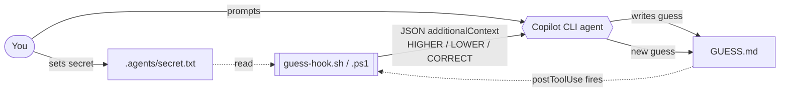

# Lab 2: Sentinel File and Hook

A hands-on demo of GitHub Copilot CLI `postToolUse` hooks via a "Higher or Lower" number-guessing game.

The AI writes a guess to a **sentinel file** (`GUESS.md`). A **hook** fires after every tool call, compares the guess to a secret number, and injects `HIGHER` / `LOWER` / `CORRECT` feedback straight back into the model's context. The AI then writes a new guess. Repeat until it wins.

---

## How it works



1. **You set a secret number** in `.agents/secret.txt` (a bare integer on its own line).
2. **You prompt the AI** to guess a number and write it to `GUESS.md`.
3. **The hook fires** after every tool call — it reads `GUESS.md` and `.agents/secret.txt`, compares them, and emits `{"additionalContext": "..."}` on stdout.
4. **Copilot CLI injects** that context back into the model so the AI sees the feedback on its next turn.
5. **The AI self-corrects** and overwrites `GUESS.md` with a new guess.
6. **Repeat** until the guess matches.

> **Note on exit codes:** the hook always exits `0`. Copilot CLI only injects `additionalContext` when the hook succeeds, so a non-zero exit would discard the feedback. All three outcomes (HIGHER / LOWER / CORRECT) exit `0` so feedback is always delivered.

---

## Quick start

### 1. Set your secret number

Edit [.agents/secret.txt](.agents/secret.txt) and replace the value with any integer (e.g. between 1 and 100):

```
73
```

### 2. Start Copilot CLI in this repository

```bash
gh copilot
```

### 3. Prompt the AI

> "Play a number-guessing game. Pick a number between 1 and 100 and write **only** the number to `GUESS.md`. Keep updating it based on the feedback you receive until you find the correct answer."

### 4. Watch the hook respond

After each write to `GUESS.md` the hook fires and the model receives context like:

```
HIGHER
```

or, on success:

```
CORRECT! The number was 73.
```

An optimal binary search should converge in ≤ 7 guesses for the 1–100 range.

---

## File structure

```
.
├── .agents/
│   ├── README.md           ← explains this directory
│   ├── secret.txt          ← YOUR secret number (change before playing)
│   └── hooks/
│       ├── guess-hook.sh   ← bash hook (macOS / Linux)
│       └── guess-hook.ps1  ← PowerShell hook (Windows)
├── .github/
│   └── hooks/
│       └── guess.json      ← repo-level hook config
├── GUESS.md                ← sentinel file written by the AI
└── README.md               ← this file
```

---

## GUESS.md format

The sentinel file contains a **bare integer**, nothing else:

```
55
```

The hook scripts read the file with `cat` / `Get-Content` and parse it directly as an integer — any extra text will break the comparison.

---

## Hook reference

The hook is wired as a `postToolUse` command hook in [.github/hooks/guess.json](.github/hooks/guess.json):

```json
{
  "version": 1,
  "hooks": {
    "postToolUse": [
      {
        "type": "command",
        "bash": "bash .agents/hooks/guess-hook.sh",
        "powershell": "pwsh -NoProfile -File .agents/hooks/guess-hook.ps1",
        "cwd": ".",
        "timeoutSec": 10
      }
    ]
  }
}
```

It fires after **every** tool call (not filtered by tool name). Each script:

1. Reads the integer from `GUESS.md`.
2. Reads the integer from `.agents/secret.txt`.
3. Prints a single-line JSON object: `{"additionalContext": "HIGHER" | "LOWER" | "CORRECT! ..."}`.
4. Exits `0` so Copilot CLI delivers the context to the model.

For full hooks documentation see: <https://docs.github.com/en/copilot/reference/hooks-reference>
